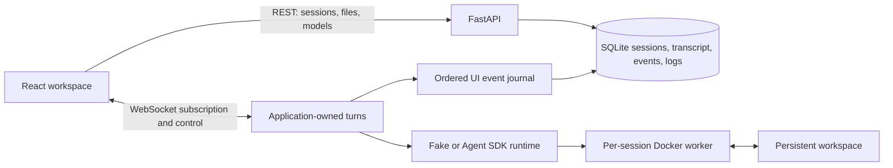

# WebAgent

[简体中文](README.zh-CN.md) · [Documentation](#documentation)

> An unofficial, local-first coding-agent workspace — chat, run tools, inspect files, and keep several tasks moving at once.

WebAgent turns a small FastAPI service and disposable Docker workers into a friendly browser workspace. Give an agent a task, watch real progress, switch to another session while it works, and come back to the result.

WebAgent is an **unofficial demo**, currently at **v0.3.0**. It supports lightweight administrator-created user profiles for separating sessions, but names are not authentication credentials and the service is not a public multi-tenant system.


*Illustrative demo · 中文 UI; provider credentials and private data are not shown.*

## Why it is fun to try

| What you can do | What happens |
|---|---|
| Keep coding conversations | Each session retains its transcript, agent context, model/effort choice, and workspace |
| Organize sessions | Rename any session from its mouse or keyboard context menu, including while its task is running |
| Work in parallel | Different sessions can run at the same time; each session still accepts one task at a time |
| Leave and return | Closing the page does not cancel an application-owned task; reconnecting replays stored events and resumes live updates |
| See honest progress | Steps, tool activity, duration, usage, completion, failure, and stop states come from runtime events—not guessed prose |
| Handle project files | Upload files or folders, browse the workspace tree, and open UTF-8 text files with syntax highlighting; editing is enabled while the agent is idle |
| Stop real work | Stop cancels the server-side stream and the command running inside the worker |
| Bring a compatible provider | The web UI discovers model IDs from an Anthropic-compatible endpoint; it does not invent descriptions or recommendations |


*Illustrative narrow-screen demo · 中文 UI.*

## Start the browser workspace

You need Python 3.11+, [uv](https://docs.astral.sh/uv/), Docker, and a browser.

```bash
docker build -t webagent-worker:latest -f Dockerfile.worker .
uv sync --locked
cp .env.example .env
```

For browser tasks, edit `.env` before starting the service:

```env
RUNTIME_BACKEND=claude
SANDBOX_BACKEND=docker
DOCKER_NETWORK_MODE=host
```

Then start the service and open <http://127.0.0.1:8000/>:

```bash
uv run uvicorn app.main:app --host 127.0.0.1 --port 8000
```

Open <http://127.0.0.1:8000/admin> first and create at least one user. A user enters that administrator-created name on the workspace welcome screen; a successful match opens only that user's sessions. The top-right account control provides logout. There is deliberately no registration, password, role, or permission system yet.

The administrator monitor is intentionally operational rather than analytical. It keeps a bounded one-hour in-memory view of host, process, workspace, and managed-container load; reports SQLite, Docker, worker-image, UI-journal, and lifecycle-reaper health; and lists running/background tasks plus consistency or cleanup issues. It does not persist performance history, probe user Providers, or perform automatic repair.

Sessions created before user ownership was introduced remain visible in the administrator table as unassigned and are intentionally hidden from named workspaces; this Demo does not perform legacy ownership migration. Saved Docker CPU, memory, and PID limits apply to newly created sandboxes after restart, not existing containers.

The browser workflow intentionally requires a Provider:

1. Open connection settings.
2. Enter an **Anthropic-compatible** Endpoint, API Key, and authentication style (`Bearer` or `x-api-key`).
3. Select **Test connection**. WebAgent reads model IDs from that endpoint.
4. Choose the default model and effort, then select **Save settings**.
5. Create a session, optionally upload a project, describe the change, and send.

Provider settings stay in that browser, are namespaced by the selected user, and are attached to each web task. WebAgent does not copy the Provider configuration or key into session metadata, transcripts, or diagnostic SQLite. A Provider-catalog failure writes a server warning containing a sanitized endpoint, authentication mode, and a short key-hash fingerprint. If an agent or command prints a secret, raw diagnostics preserve that output. Changing a connection field invalidates the test result, so test and save again.

After a Provider is verified and saved, the browser performs a real catalog heartbeat every 15 seconds. The top-right badge reports that browser → WebAgent → Provider path even when no Session exists. A failure becomes **Connection interrupted** without discarding the saved catalog or defaults; recovery returns to **Connected** automatically. Session WebSockets reconnect independently and replay persisted events, so a temporary browser-network interruption does not cancel an application-owned turn.

The model menu intentionally displays IDs only. Providers do not expose a universal, trustworthy format for model descriptions, prices, capabilities, or recommendations.

`RUNTIME_BACKEND=claude` runs the pinned Claude Agent SDK inside the worker. `claude-cli` remains an explicit compatibility fallback. Provider endpoint, credentials, authentication mode, and model come exclusively from the browser with each turn. WebAgent is provider-neutral; no model vendor or model ID is hard-coded into the product flow.

The example defaults to `RUNTIME_BACKEND=fake` for deterministic development and automated checks. It does not bypass the browser's Provider validation, so it is not a no-Provider browser task workflow. If Docker is unavailable, `SANDBOX_BACKEND=local` is a lightweight development fallback; it separates directories but is not a security boundary.

## How it fits together



The application—not the socket—owns a running web turn. A disconnected browser only unsubscribes. On reconnect, WebAgent subscribes first, replays the durable prefix plus any in-memory suffix, then continues with live events without duplicating `(session, turn, sequence)` keys. A **service-process restart still aborts running turns**; completed history and workspace data remain, but execution itself is not resumable across a restart.

## Logs and safety boundary

The Session log is an ordered execution transcript with user input, Assistant output, tools, Bash commands, and tool results; low-level SDK events and raw JSON stay collapsed until needed. Common credential forms are masked, but this is not a general DLP system. Treat logs, `data/`, uploaded workspaces, and databases as sensitive.

The name gate and session owner field provide product-level separation only; they are **not authentication or authorization**. Administrator APIs are also open. Docker workers reduce accidental host access but are not hardened for hostile code. Application settings default `HOST` to `127.0.0.1`, but Uvicorn's CLI does not read that setting as its own bind flag—keep the explicit `--host 127.0.0.1` shown above. Use only trusted projects and users, and place a real authentication proxy in front before exposing the service to any network. See [SECURITY.md](SECURITY.md).

## Development and verified status

```bash
uv sync --locked --dev
uv run ruff format --check .
uv run ruff check .
uv run pytest -q -m "not integration" --ignore=tests/browser

cd frontend
npm ci
npm run check
cd ..

uv run playwright install --with-deps chromium webkit
uv run pytest -q tests/browser

docker build -t webagent-worker:latest -f Dockerfile.worker .
uv run pytest -q -m integration tests/integration
```

The basic Python suite, browser suite, and Docker integration suite are separate so a fresh machine has explicit prerequisites. Push and pull-request CI run the Python checks, frontend audit/tests/build, wheel build/install verification, and Chromium/WebKit browser tests. Docker integration is intentionally limited to manual workflow runs and published releases.

Repository-owner `@codex` mentions can also answer discussions or prepare tested changes through a guarded repository-specific self-hosted runner. Public callers are denied unless explicitly allowlisted, and generated changes are never auto-merged. See [GitHub `@codex` collaboration](docs/CODEX_MENTIONS.md).

Run the commands above in the target branch before release. The focused verification scope and environment limits are documented in [the test guide](docs/TEST_REPORT.md).

## Documentation

- [Architecture and event lifecycle](docs/ARCHITECTURE.md)
- [Product brief: current and target experience](PRODUCT_BRIEF.md)
- [Design decisions](docs/DECISIONS.md)
- [Limitations and roadmap](docs/LIMITATIONS_AND_ROADMAP.md)
- [Engineering learnings](docs/LEARNINGS.md)
- [Test report](docs/TEST_REPORT.md)
- [Changelog](docs/CHANGELOG.md)
- [Security policy](SECURITY.md)
- [GitHub `@codex` collaboration](docs/CODEX_MENTIONS.md)

## License

[MIT](LICENSE). WebAgent is an unofficial project and is not affiliated with or endorsed by any model provider.
