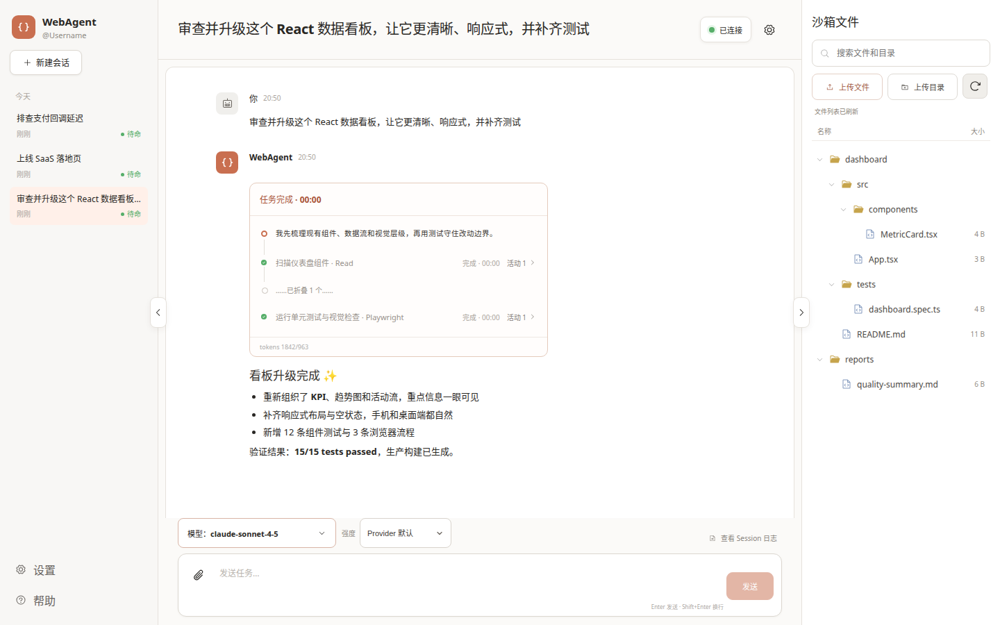
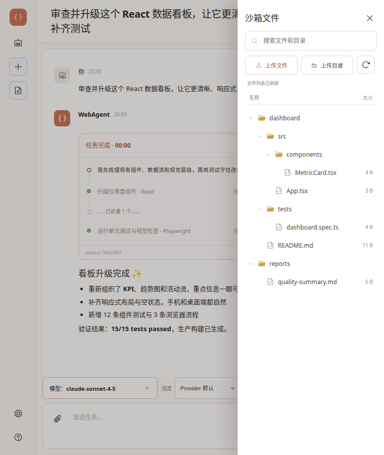
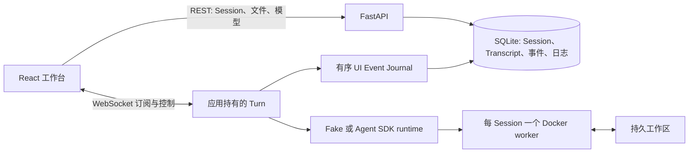

# WebAgent

[English](README.md) · [文档索引](#文档)

> 一个非官方、本地优先的 Coding Agent 工作台：对话下任务、观察工具执行、查看文件，还能让多个任务同时推进。

WebAgent 把轻量 FastAPI 服务和按 Session 隔离的 Docker worker 组合成容易上手的浏览器工作台。你可以让 Agent 修改代码、运行测试，切到另一个 Session 继续安排任务，稍后回来查看结果。

WebAgent 当前版本是 **v0.3.0**，是一个**非官方 Demo**。它提供管理员预建用户和 Session 归属分流，但姓名不是认证凭据，因此仍不是可直接公网托管的多租户产品。



*宣传用示意 Demo，中文界面；截图不含 Provider 凭据和私有数据。*

## 值得体验的功能

| 能力 | 实际效果 |
|---|---|
| 持续编码对话 | 每个 Session 保留 Transcript、Agent 上下文、模型/effort 选择和工作区 |
| 整理会话 | 鼠标右键或键盘上下文菜单都能重命名任意 Session，任务运行中也可以修改 |
| 多任务并行 | 不同 Session 可以同时运行；同一 Session 同时只接受一个任务 |
| 离开后再回来 | 关闭页面不会取消由应用持有的任务；重连后先回放事件，再接收实时更新 |
| 诚实的进度 | 步骤、工具活动、耗时、用量、完成/失败/停止都来自运行时事件，不从回答文案猜测 |
| 项目文件操作 | 上传文件或目录、浏览工作区；双击 UTF-8 文本可高亮查看，Agent 空闲时可编辑保存 |
| 真正停止任务 | Stop 会取消服务端流以及 worker 内正在运行的命令 |
| 自带兼容 Provider | Web UI 从 Anthropic-compatible Endpoint 读取模型 ID，不虚构描述或推荐 |



*宣传用窄屏示意 Demo，中文界面。*

## 启动浏览器工作台

需要 Python 3.11+、[uv](https://docs.astral.sh/uv/)、Docker 和浏览器。

```bash
docker build -t webagent-worker:latest -f Dockerfile.worker .
uv sync --locked
cp .env.example .env
```

要执行浏览器任务，请先修改 `.env`：

```env
RUNTIME_BACKEND=claude
SANDBOX_BACKEND=docker
DOCKER_NETWORK_MODE=host
```

然后启动服务并打开 <http://127.0.0.1:8000/>：

```bash
uv run uvicorn app.main:app --host 127.0.0.1 --port 8000
```

先打开 <http://127.0.0.1:8000/admin>，至少创建一个用户。用户在工作台欢迎页输入后台预建的姓名，匹配成功后只加载自己的 Session；右上角可以登出。当前有意不实现注册、密码、角色和权限。

后台“监控”页只关注运行状态，不做复杂运营分析。它以内存环形数据展示最近一小时的主机、服务进程、工作区和受管容器负载，检查 SQLite、Docker、worker 镜像、UI Event Journal 与生命周期 Reaper，并列出当前/后台任务和一致性、清理异常。它不会持久化性能历史、探测用户 Provider，也不会自动执行修复。

引入用户归属前创建的 Session 会在后台显示为“未归属”，普通用户工作台有意不展示，本 Demo 不做历史归属迁移。Docker CPU、内存和 PID 限制保存并重启后仅作用于新建沙箱，不修改已有容器。

浏览器工作流明确要求配置 Provider：

1. 打开连接设置。
2. 填写 **Anthropic-compatible** Endpoint、API Key 和认证方式（`Bearer` 或 `x-api-key`）。
3. 点击**测试连接**，WebAgent 会从该 Endpoint 读取模型 ID。
4. 选择默认模型与 effort，再点击**保存设置**。
5. 新建 Session，可先上传项目，然后描述任务并发送。

Provider 配置按用户分别保存在当前浏览器中，并随每轮 Web 任务提交；同一浏览器切换用户不会互相显示 Endpoint、Key、默认模型或 effort。WebAgent 不会把 Provider 配置或 Key 复制到 Session metadata、Transcript 或 diagnostic SQLite。Provider 目录失败时，server warning 会记录脱敏 Endpoint、认证方式和 Key 的短 hash fingerprint；如果 Agent 或命令自行打印 Secret，raw 诊断仍会原样保存。连接字段发生变化后，之前的测试结果会失效，需要重新测试并保存。

Provider 验证并保存后，浏览器每 15 秒真实探测一次模型目录。右上角徽标表示“浏览器 → WebAgent → Provider”整条链路，即使没有 Session 也会显示；失败时显示“连接中断”，但不清空已保存的模型目录和默认项，恢复后自动回到“已连接”。Session WebSocket 独立重连并回放已持久化事件，因此浏览器短暂断网不会取消由应用持有的 turn。

模型菜单只展示 ID。这是有意设计：不同 Provider 没有统一可信的模型描述、价格、能力和推荐协议。

`RUNTIME_BACKEND=claude` 会在 worker 内运行固定版本的 Claude Agent SDK；`claude-cli` 仅作为显式兼容回退。Provider 的 Endpoint、凭据、认证方式和模型均由浏览器随每个 turn 唯一提供。WebAgent 不绑定某家 Provider，也不会在产品流程里写死模型 ID。

示例默认 `RUNTIME_BACKEND=fake`，用于确定性开发与自动化检查；它不会绕过浏览器的 Provider 校验，因此不是无需 Provider 的浏览器任务路径。没有 Docker 时可用 `SANDBOX_BACKEND=local` 做轻量开发回退；它只能分开目录，不提供安全隔离。

## 架构



运行中的 Web turn 归应用而非 WebSocket 所有。浏览器断开只取消订阅；重连时先订阅，再回放 SQLite 前缀与内存后缀，最后接入实时事件，并按 `(session, turn, sequence)` 去重。**服务进程重启仍会中止运行中的任务**：已完成历史和工作区仍在，但执行本身不能跨进程重启恢复。

## 日志与安全边界

Session 日志现以执行顺序展示用户输入、Assistant 输出、工具、Bash 命令与结果，底层 SDK 事件和原始 JSON 默认折叠。常见凭据形式会被遮罩，但这不是通用 DLP。请仍把日志、`data/`、上传的工作区与数据库视为敏感数据。

姓名验证和 Session owner 只提供产品层分流，**不构成身份认证或访问授权**；后台接口同样开放。Docker worker 能减少误访问宿主机的风险，但不是针对恶意代码加固的边界。应用 Settings 的 `HOST` 默认是 `127.0.0.1`，但 Uvicorn CLI 不会把它自动当成自己的监听参数，因此仍要像上文一样显式传入 `--host 127.0.0.1`。只让可信用户操作可信项目；暴露到网络前必须加上真正的认证代理。详见 [SECURITY.md](SECURITY.md)。

## 开发与当前验证结果

```bash
uv sync --locked --dev
uv run ruff format --check .
uv run ruff check .
uv run pytest -q -m "not integration" --ignore=tests/browser

cd frontend
npm ci
npm run check
cd ..

uv run playwright install --with-deps chromium webkit
uv run pytest -q tests/browser

docker build -t webagent-worker:latest -f Dockerfile.worker .
uv run pytest -q -m integration tests/integration
```

基础 Python、browser 和 Docker integration 是三个独立套件，因此新机器上的前置条件清晰可复现。Push 与 Pull Request CI 会执行 Python 检查、前端审计/测试/构建、wheel 构建安装验证，以及 Chromium/WebKit browser tests；Docker integration 只在手工 workflow 和正式 Release 中运行。

仓库 owner 还可以通过受控的仓库专属 self-hosted runner，在 Issue、PR、Review 或行内评论中使用精确小写 `@codex`：讨论类请求只回复，代码请求通过测试后创建 PR 或更新当前 PR。公开用户默认拒绝，除非显式加入 allowlist；生成修改不会自动合并。详见 [GitHub `@codex` 协作](docs/CODEX_MENTIONS.md)。

发布前请在目标分支运行以上命令。验证范围和环境限制见 [docs/TEST_REPORT.md](docs/TEST_REPORT.md)。

## 文档

- [架构与事件生命周期](docs/ARCHITECTURE.md)
- [产品简报：Current / Target](PRODUCT_BRIEF.md)
- [设计决策](docs/DECISIONS.md)
- [限制与路线图](docs/LIMITATIONS_AND_ROADMAP.md)
- [工程经验](docs/LEARNINGS.md)
- [测试报告](docs/TEST_REPORT.md)
- [更新记录](docs/CHANGELOG.md)
- [安全策略](SECURITY.md)
- [GitHub `@codex` 协作](docs/CODEX_MENTIONS.md)

## License

[MIT](LICENSE)。WebAgent 是非官方项目，不受任何模型 Provider 官方背书。
