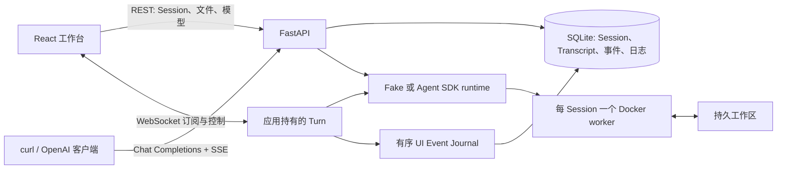

# WebAgent

[English](README.md) · [文档索引](#文档)

> 一个非官方、本地优先的 Coding Agent 工作台：对话下任务、观察工具执行、查看文件，还能让多个任务同时推进。

WebAgent 把轻量 FastAPI 服务和按 Session 隔离的 Docker worker 组合成容易上手的浏览器工作台。你可以让 Agent 修改代码、运行测试，切到另一个 Session 继续安排任务，稍后回来查看结果。项目也保留了精简的 OpenAI-compatible API 和确定性的 Fake runtime，因此不购买模型额度也能体验完整的 Session 与流式流程。

WebAgent 当前版本是 **v0.3.0**，是一个**非官方 Demo**。它适合可信本机上的单人体验，不是可直接公网托管的多人产品。


*宣传用示意 Demo，中文界面；截图不含 Provider 凭据和私有数据。*

## 值得体验的功能

| 能力 | 实际效果 |
|---|---|
| 持续编码对话 | 每个 Session 保留 Transcript、Agent 上下文、模型/effort 选择和工作区 |
| 多任务并行 | 不同 Session 可以同时运行；同一 Session 同时只接受一个任务 |
| 离开后再回来 | 关闭页面不会取消由应用持有的任务；重连后先回放事件，再接收实时更新 |
| 诚实的进度 | 步骤、工具活动、耗时、用量、完成/失败/停止都来自运行时事件，不从回答文案猜测 |
| 项目文件操作 | 上传文件或目录、浏览工作区，双击文件即可下载 |
| 真正停止任务 | Stop 会取消服务端流以及 worker 内正在运行的命令 |
| 自带兼容 Provider | Web UI 从 Anthropic-compatible Endpoint 读取模型 ID，不虚构描述或推荐 |
| 脚本集成 | 提供精简的 OpenAI Chat Completions-compatible 流式 API |


*宣传用窄屏示意 Demo，中文界面。*

## 快速开始：不需要 Provider

需要 Python 3.11+、[uv](https://docs.astral.sh/uv/)、Docker 和 curl。

```bash
docker build -t webagent-worker:latest -f Dockerfile.worker .
uv sync --locked
cp .env.example .env
uv run uvicorn app.main:app --host 127.0.0.1 --port 8000
```

打开另一个终端：

```bash
curl http://127.0.0.1:8000/healthz
./scripts/smoke_curl.sh
```

示例配置默认使用 `FakeRuntime` 和 Docker sandbox。Fake curl 路径**不需要 Provider Endpoint 或 API Key**：它会创建真实 Session 与工作区，流式返回确定性结果，生成计算器文件、运行测试、继续同一 Session，并检查生命周期接口。没有 Docker 时可用 `SANDBOX_BACKEND=local` 做轻量开发回退；它只能分开目录，不提供安全隔离。

## 使用真实 Web 工作台

默认 Fake runtime 不会因为浏览器填写了 Provider 就变成真实 Agent。先修改 `.env` 并重启 WebAgent：

```env
RUNTIME_BACKEND=claude
SANDBOX_BACKEND=docker
DOCKER_NETWORK_MODE=host
```

然后打开 <http://127.0.0.1:8000/>。浏览器工作流明确要求配置 Provider：

1. 打开连接设置。
2. 填写 **Anthropic-compatible** Endpoint、API Key 和认证方式（`Bearer` 或 `x-api-key`）。
3. 点击**测试连接**，WebAgent 会从该 Endpoint 读取模型 ID。
4. 选择默认模型与 effort，再点击**保存设置**。
5. 新建 Session，可先上传项目，然后描述任务并发送。

Provider 配置保存在当前浏览器中，并随每轮 Web 任务提交。WebAgent 不会把 Provider 配置或 Key 复制到 Session metadata、Transcript 或 diagnostic SQLite。Provider 目录失败时，server warning 会记录脱敏 Endpoint、认证方式和 Key 的短 hash fingerprint；如果 Agent 或命令自行打印 Secret，raw 诊断仍会原样保存。连接字段发生变化后，之前的测试结果会失效，需要重新测试并保存。

模型菜单只展示 ID。这是有意设计：不同 Provider 没有统一可信的模型描述、价格、能力和推荐协议。

给 OpenAI-compatible curl 路径使用真实 SDK runtime 时，还可以配置可选的部署级默认值：

```env
RUNTIME_BACKEND=claude
SANDBOX_BACKEND=docker
CLAUDE_API_KEY=<你的 Key>
CLAUDE_BASE_URL=<Anthropic-compatible 基础地址>
CLAUDE_MODEL=<该 Provider 返回的模型 ID>
CLAUDE_AUTH_ENV=ANTHROPIC_API_KEY
DOCKER_NETWORK_MODE=host
```

`RUNTIME_BACKEND=claude` 会在 worker 内运行固定版本的 Claude Agent SDK；`claude-cli` 仅作为显式兼容回退。WebAgent 不绑定某家 Provider，也不会在产品流程里写死模型 ID。

## curl API 示例

下面的 API Key 只保护 OpenAI-compatible 接口，与 Provider Key 是两回事：

```bash
curl -N http://127.0.0.1:8000/v1/chat/completions \
  -H 'Authorization: Bearer demo-local-key' \
  -H 'Content-Type: application/json' \
  -H 'X-Session-ID: hello-webagent' \
  -d '{
    "model": "claude-code-agent",
    "stream": true,
    "messages": [{"role": "user", "content": "创建一个支持加法的计算器并运行测试"}]
  }'
```

继续使用相同的 `X-Session-ID` 即可多轮对话。FakeRuntime 支持计算器/加法、减法、`mock:write`、`mock:choice`、`permission`、`mock:slow` 和 `mock:error` 等演示触发词。

## 架构



运行中的 Web turn 归应用而非 WebSocket 所有。浏览器断开只取消订阅；重连时先订阅，再回放 SQLite 前缀与内存后缀，最后接入实时事件，并按 `(session, turn, sequence)` 去重。**服务进程重启仍会中止运行中的任务**：已完成历史和工作区仍在，但执行本身不能跨进程重启恢复。

## 日志与安全边界

Session 日志是排障视图，不是脱敏后的活动摘要。根据运行时事件，它可能包含完整命令、参数、工具输出、文件内容、Prompt、Endpoint 信息和错误输出。请把日志、`data/`、上传的工作区与数据库都视为敏感数据。

Web、Session、文件和日志路由**没有用户鉴权或租户隔离**。Docker worker 能减少误访问宿主机的风险，但不是针对恶意代码加固的边界。应用 Settings 的 `HOST` 默认是 `127.0.0.1`，但 Uvicorn CLI 不会把它自动当成自己的监听参数，因此仍要像上文一样显式传入 `--host 127.0.0.1`。只让可信用户操作可信项目；暴露到网络前必须加上真正的认证代理。详见 [SECURITY.md](SECURITY.md)。

## 开发与当前验证结果

```bash
uv sync --locked --dev
uv run ruff format --check .
uv run ruff check .
uv run pytest -q -m "not integration" --ignore=tests/browser

cd frontend
npm ci
npm run check
cd ..

uv run playwright install --with-deps chromium webkit
uv run pytest -q tests/browser

docker build -t webagent-worker:latest -f Dockerfile.worker .
uv run pytest -q -m integration tests/integration
```

基础 Python、browser 和 Docker integration 是三个独立套件，因此新机器上的前置条件清晰可复现。Push 与 Pull Request CI 会执行 Python 检查、前端审计/测试/构建、wheel 构建安装验证，以及 Chromium/WebKit browser tests；Docker integration 只在手工 workflow 和正式 Release 中运行。

当前 v0.3.0 发布证据：

- Python：**193 passed, 1 skipped, 1 warning**
- 浏览器：**34 passed, 1 skipped**（包含窄屏设置入口）
- 前端协议：**3 passed**
- Docker integration：**5 passed**（包含跨 UID workspace 访问）
- `npm audit`：**0 vulnerabilities**
- Fake/local curl smoke：**passed**

跳过项是已记录的 WebKit 环境限制；Chromium 覆盖通过。当前完整矩阵见 [docs/TEST_REPORT.md](docs/TEST_REPORT.md)。

## 文档

- [架构与事件生命周期](docs/ARCHITECTURE.md)
- [产品简报：Current / Target](PRODUCT_BRIEF.md)
- [设计决策](docs/DECISIONS.md)
- [限制与路线图](docs/LIMITATIONS_AND_ROADMAP.md)
- [工程经验](docs/LEARNINGS.md)
- [测试报告](docs/TEST_REPORT.md)
- [更新记录](docs/CHANGELOG.md)
- [安全策略](SECURITY.md)

## License

[MIT](LICENSE)。WebAgent 是非官方项目，与 OpenAI 或 Anthropic 均无隶属关系或官方背书。
