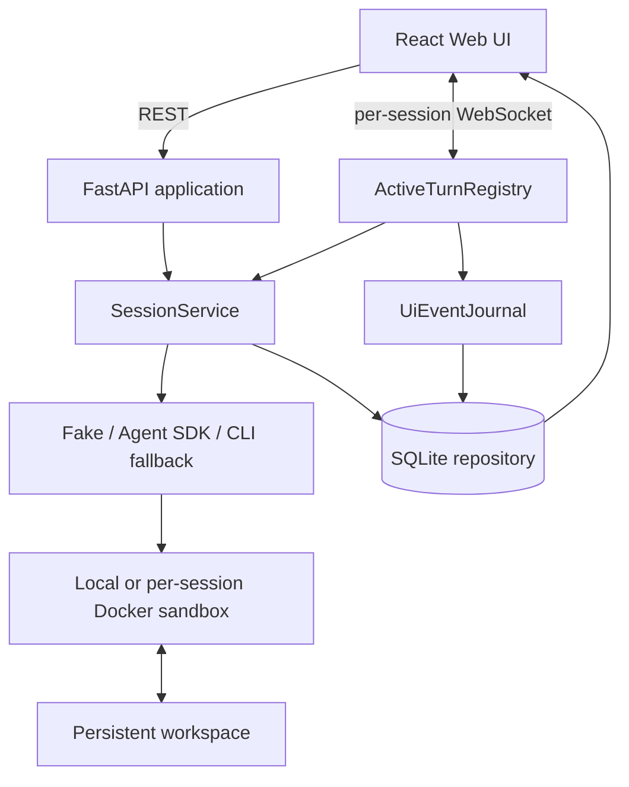
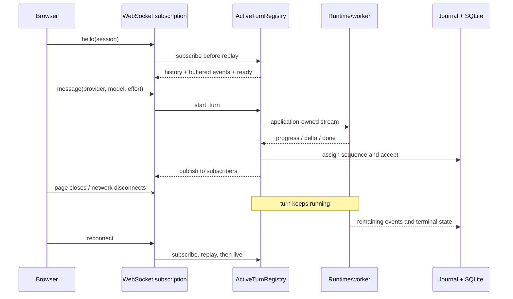

# WebAgent 架构

本文描述 v0.3.0 当前实现，重点是 Session、应用持有的 turn、WebSocket 订阅、事件回放与 Docker workspace 的关系。

## 系统结构

REST 负责 Session、Transcript、history、文件、诊断日志和 Provider model discovery。WebSocket 负责某个 Session 的 UI event 订阅、发起 web turn、ping 与 stop。

## 用户与后台管理

SQLite 保存管理员预建的用户记录和 Session `owner_user_id`。工作台首次进入通过姓名查找启用用户，随后 REST 使用 `X-WebAgent-User-ID`、WebSocket `hello` 使用 `user_id`；服务端据此过滤 Session，并对跨用户 Session 返回不存在。Provider、默认模型和 effort 仍按用户命名空间保存在浏览器，不由后台托管。

这不是安全认证：没有密码、Token、注册、角色或权限，后台接口也完全开放。无用户头的调用保留给本地后台和测试控制面。未来接入认证时，应替换统一身份依赖，而不是改变 Session owner 和传输边界。

可管理运行参数保存在 SQLite `managed_settings` 中，并通过版本号做并发更新。后台同时展示当前运行值与保存值；保存值在下一次服务启动时合并进启动配置，页面不会自动重启服务。数据库位置、监听地址等引导应用启动的参数仍属于启动配置。

已有 Docker 容器不会在启动时重新应用 CPU、内存或 PID 限制，因此这些资源参数只影响重启后新建的沙箱。旧数据库迁移只增加可空 owner 字段；未归属的旧 Session 保留在后台，但不出现在任何具名用户工作台。

## Session 与 workspace

Session 是持久身份，同时关联 runtime 类型、sandbox 类型、生命周期、最近模型/effort、Transcript、诊断日志和 workspace。Docker 后端为每个 Session 创建带标签的非 root worker，将宿主 Session 目录绑定到容器 `/workspace`。暂停、恢复与删除通过幂等 sandbox 操作协调。

同一 Session 使用服务级锁和 active-turn registry 拒绝第二个并发任务；不同 Session 可以并行。

## 应用持有的 turn

v0.3.0 的关键合同是：**运行任务属于 FastAPI 应用生命周期，不属于发起它的 WebSocket。**

断线只执行 unsubscribe，不取消 producer。Stop 帧必须携带 turn ID，由 registry 校验并取消对应 producer；取消后的 terminal gate 保证 normal/failed/stopped/aborted 只有一个最终结果。应用 shutdown 是唯一批量取消所有 active turns 的边界，因此服务进程重启仍会中止运行任务。

## 有序事件与无缝重连

每个 producer 先生成未编号 intent；registry 在 dispatch 边界分配逐 turn 单调递增的 sequence，并将事件同步 `accept` 到进程级 Journal，再发布给订阅者。

Journal 使用单进程 FIFO writer：

- SQLite 已写入部分是 durable prefix；尚未写入的内存队列是 pending suffix。
- 瞬时 SQLite 失败保留队头并退避，后续事件不能越过它。
- 同 key 不同 payload 是永久 invariant 冲突：隔离并强告警，避免阻塞其他 Session。
- history 合并 prefix 与 suffix，并按 `(session_id, turn_id, sequence)` 去重。

重连先建立订阅，再读取 history。读取期间产生的新事件会进入订阅 FIFO；回放后发送有限 buffered batch，再发 `ready`，最后进入 live forwarding。这避免 replay/live 交界处遗漏事件。

Journal 不是持久任务队列。进程崩溃可能丢失尚未写入 SQLite 的短暂内存 suffix；更重要的是，runtime 执行状态不能跨进程恢复。

## Provider 与模型

Web UI 把 Endpoint、API Key 与认证方式保存在浏览器，先调用 `/v1/web/models` 验证动态目录，再选择默认模型/effort并保存。每个 message 携带 Provider 配置快照；服务端按 turn 使用，不把配置或 Key 写入 Session metadata、Transcript 或 diagnostic SQLite。Provider 目录失败的 server warning 会使用脱敏 Endpoint、认证方式和 Key 短 hash fingerprint。模型目录只把 ID 视为稳定事实。

保存后，浏览器每 15 秒调用一次 `/v1/web/models` 作为真实双链路心跳；该请求不复用跨请求目录缓存。Provider 健康状态与每个 Session 的 WebSocket 状态分离：前者驱动全局连接徽标，后者继续控制发送、停止、后台 turn 订阅和重连回放。心跳失败不删除已保存的目录或默认项，后续成功会自动恢复状态。

Web UI 必须提供客户端 Provider。服务端按当前 turn 使用该配置，不将其转为部署级默认值。

## 三层历史

| 数据 | 用途 | 内容边界 |
|---|---|---|
| Transcript | 恢复聊天气泡 | 用户消息与 Agent 可见答复 |
| UI events | 恢复任务卡并衔接实时流 | step、activity、delta、usage、terminal 等协议事件 |
| Diagnostic log | 深度排障 | SDK/工具/任务事件，可能含完整命令、参数、输出和文件内容 |

三层不可互相替代。诊断日志会遮罩常见 Provider/API key、Authorization、token 和 Cookie 形式，但并非通用 DLP，仍应视为敏感数据。应用不把 Provider 配置或 Key 复制到上述三类持久记录；目录失败的 server warning 另行记录脱敏 Endpoint、auth mode 与短 hash fingerprint。thinking 正文不作为产品进度展示。

## 部署边界

当前只支持单 Uvicorn worker。锁、active turn、pending journal 与订阅均为进程内状态；多 worker 或多实例需要数据库租约、所有权和跨实例事件分发。默认监听 `127.0.0.1`；当前只有姓名分流而没有身份认证或租户授权，不应直接暴露到不可信网络。
